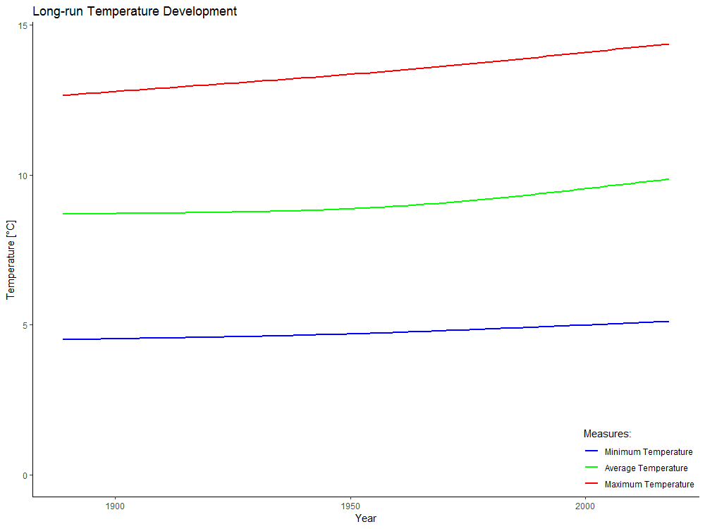
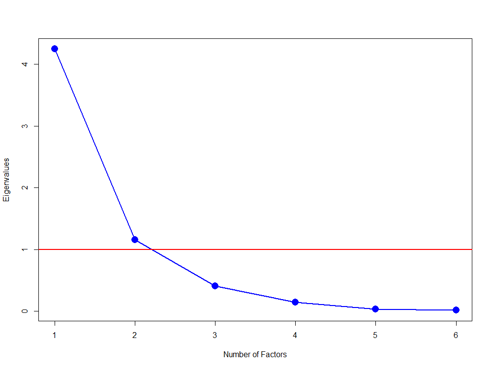
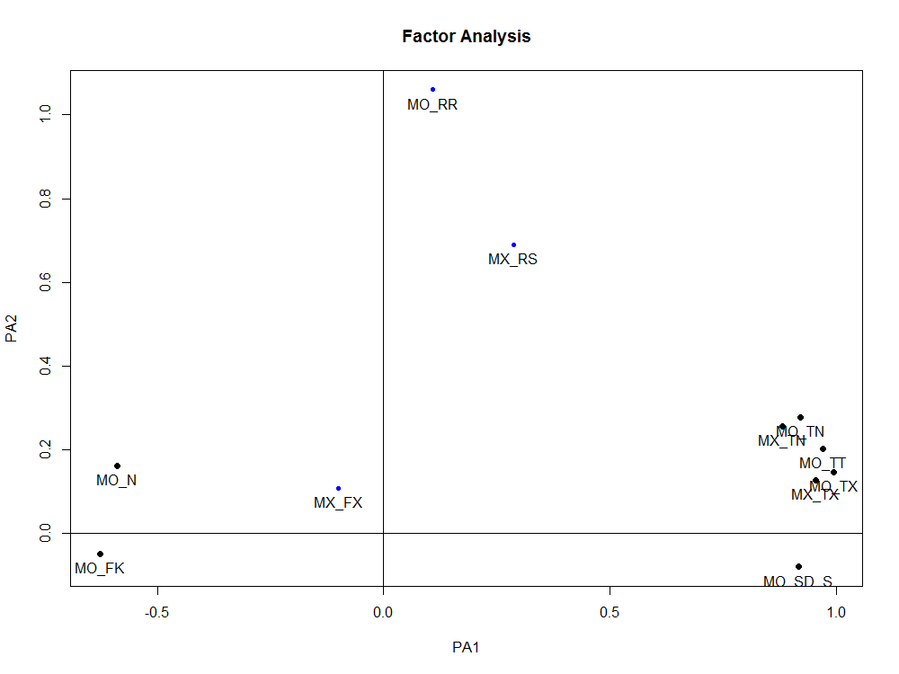
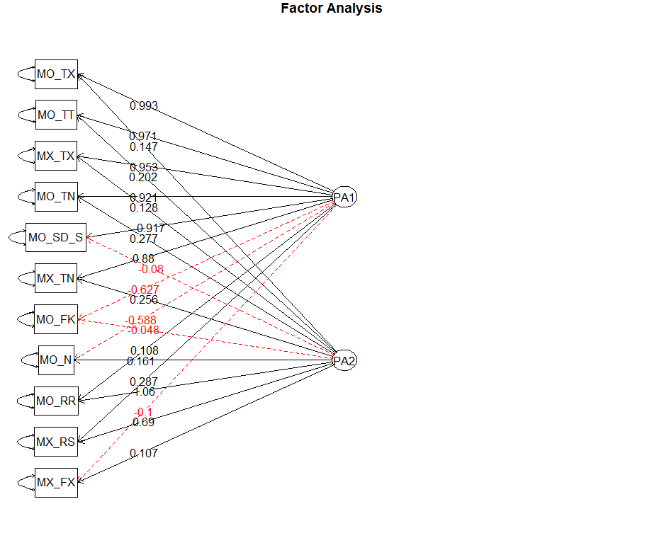

# SPL_WeatherTourism_02weatherAnalysis  

```
Name of Quantlet: SPL_WeatherTourism_02weatherAnalysis

Published in:     'Statistical programming languages - Student Project on ''Impact of Meteorological Factors on Regional Tourism'' '

Description:      'Analysis and Transformation of the daily and monthly weather observations, Categorization of Days, Visualization of Weather Developments'

Keywords:         meteorological analysis, categorization, transformation, visualization, missing data

Author:           Tim Peschenz

Submitted:        So, Mar 17 2019
```










## R Code
```R
# Name of Quantlet: SPL_WeatherTourism_02weatherAnalysis
# Published in:     'Statistical programming languages - Student Project on ''Impact of Meteorological Factors on Regional Tourism'' '
# Description:      'Analysis and Transformation of the daily and monthly weather observations, Categorization of Days, Visualization of Weather Developments'
# Keywords:         meteorological analysis, categorization, transformation, visualization, missing data
# Author:           Tim Peschenz
# Submitted:        So, Mar 17 2019


############################################################
## Analysis of Weather
############################################################

### Handle Missing Data for monthly weather data ###
#count column-wise NAs
na_count = sapply(tourism, function(x){sum(is.na(x))})

#extracting relevant columns
na_count[which(na_count != 0)]

## calculate month-wise means for all potentially relevant tourism and weather variables
#extract numeric columns
numeric_cols             = unlist(lapply(tourism, is.numeric)) 
tourism_num              = data.frame("month" = seq(1:12), tourism[ , numeric_cols])
tourism_num[c(2, 3, 13)] = NULL

#month-wise aggregation by calculating the mean
mon = tourism_num %>%
  group_by(month) %>%
  summarise_all(funs(mean), na.rm = TRUE)

month_means = data.frame(mon)

#change column names of month-wise observations by adding '_mean' label to the name
colnames(month_means) = paste("mean_", colnames(tourism_num), sep = "")

#adding month names (January - December)
month_means = data.frame("month_name" = month.name, month_means)

#exchanging the missing values with the mean of the particular month from month_means data frame
tourism$MO_N[is.na(tourism$MO_N)]   = 
  month_means$mean_MO_N[as.numeric(format(tourism$date_beg, format="%m"))[is.na(tourism$MO_N)]]
tourism$MO_FK[is.na(tourism$MO_FK)] = 
  month_means$mean_MO_FK[as.numeric(format(tourism$date_beg, format="%m"))[is.na(tourism$MO_FK)]]
tourism$MO_RR[is.na(tourism$MO_RR)] = 
  month_means$mean_MO_RR[as.numeric(format(tourism$date_beg, format="%m"))[is.na(tourism$MO_RR)]]


### check for missing data in daily weather data ###
na_count = sapply(weather_daily, function(x){sum(is.na(x))})

#extracting relevant columns
na_count[which(na_count != 0)]

#replace missing values with mean value 
weather_daily$FX[is.na(weather_daily$FX)] = mean(weather_daily$FX, na.rm = TRUE)
weather_daily$FM[is.na(weather_daily$FM)] = mean(weather_daily$FM, na.rm = TRUE)
weather_daily$NM[is.na(weather_daily$NM)] = mean(weather_daily$NM, na.rm = TRUE)

#Since there are no highly season-specific variables missing like temperature, replacing the  
#missing values with the overall mean is appropriate in this case.


### long time development of weather for the whole available period of time ###
#temperature development (1887 - 2017)
ggplot(data = weather_all, aes(x = date_beg)) + 
  geom_smooth(aes(y = MO_TT, color = "MO_TT"), method = "auto", se = FALSE) +
  geom_smooth(aes(y = MO_TX, color = "MO_TX"), method = "auto", se = FALSE) +
  geom_smooth(aes(y = MO_TN, color = "MO_TN"), method = "auto", se = FALSE) +
  labs(title = "Long-run Temperature Development", x = "Year", y = "Temperature [°C]", color = "Measures:") +
  scale_color_manual(labels = c("Minimum Temperature", "Average Temperature", "Maximum Temperature"), values = c("blue", "green", "red")) +
  expand_limits(y = 0) +
  theme_bw() +
  theme(panel.border         = element_blank(), 
        panel.grid.major     = element_blank(),
        panel.grid.minor     = element_blank(), 
        axis.line            = element_line(colour = "black"),
        legend.justification = c(1,0), 
        legend.position      = c(1,0))


### categorize days as rainy, sunny, cloudy, windy, hot ###
#rainy days (rainfall amount above 1mm a day)
weather_daily$rainy = sapply(weather_daily$RSK, FUN = function(x) ifelse(x > 1, 1, 0))

#count total number of rainy days in time period
sum(weather_daily$rainy)

#percentage of rainy days
sum(weather_daily$rainy)/(nrow(weather_daily))


#sunny days (sunshine hours above 10 hours a day)
weather_daily$sunny = sapply(weather_daily$SDK, FUN = function(x) ifelse(x > 10, 1, 0))

#count total number of sunny days in time period
sum(weather_daily$sunny)

#percentage of sunny days 
sum(weather_daily$sunny)/(nrow(weather_daily))


#cloudy days (cloud coverage above 7.75 on okta scale)
weather_daily$cloudy = sapply(weather_daily$NM, FUN = function(x) ifelse(x > 7.75, 1, 0))

#count total number of cloudy days in time period
sum(weather_daily$cloudy)

#percentage of cloudy days
sum(weather_daily$cloudy)/(nrow(weather_daily))


#windy days (wind speed above 6 m/s)
weather_daily$windy = sapply(weather_daily$FX, FUN = function(x) ifelse(x > 6, 1, 0))

#count total number of windy days in time period
sum(weather_daily$windy)

#percentage of windy days
sum(weather_daily$windy)/(nrow(weather_daily))


#hot days (maximum temperature above 27 °C)
weather_daily$hot = sapply(weather_daily$TXK, FUN = function(x) ifelse(x > 27, 1, 0))

#count total number of hot days in time period
sum(weather_daily$hot)

#percentage of hot days
sum(weather_daily$hot)/(nrow(weather_daily))


#Due to the design of the categorization, it is possible that a specific day can belong to none, one or 
#several of the different weather categories.


### aggregate weather categories according to month-year combination to create day counts per month ###
weather_days = weather_daily[, c(12:17)]
days         = data.frame(weather_days %>% group_by(date_id) %>% summarize_all(sum))

#arrange observations in correct time order
days$month = substr(days$date_id, 1, 2)
days$year  = substr(days$date_id, 4, 7)

days = days %>% arrange(year, month)

#adding day counts of weather categories to respective observation in tourism data frame
tourism$rainy  = days$rainy
tourism$sunny  = days$sunny
tourism$cloudy = days$cloudy
tourism$windy  = days$windy
tourism$hot    = days$hot


### create data frame with monthly weather deviations ###
weather_num   = data.frame(tourism[, c(3:11, 13, 14)])
weather_means = data.frame(month_means[3:13])

#compare variable names
data.frame(colnames(weather_num), colnames(weather_means))

#repeat means for whole observation period
weather_means = do.call("rbind", replicate(8, weather_means, simplify = FALSE))

#calculate deviations by subtracting the actual observations from the corresponding month-wise mean values
weather_deviation = weather_num - weather_means


### check for possible reductions of weather variables using factor analysis ###
#prepare data frame for factor analysis
fa = data.frame(weather_num)

#normalize data frame
fa_n = scale(fa)

#create correlation matrix for numeric variables
fa_cor = round(cor(fa_n), 3)

#The different temperature (MO_T...) measures are highly correlated with each other. The sun hours (MO_SD_S)
#are also highly positively correlated with the temperature measures. Sun hours are also negatively 
#correlated with the degree of cloud coverage (MO_N).

#visualize correlations
corrplot(fa_cor, method="circle", type = "upper", col = brewer.pal(n=8, name="RdYlBu"))

#create screeplot to specify numbers of factors
plot(eigen(cor(fa[, 3:8]))$values, type = "o", col = "blue", pch = 16, 
     cex = 2, xlab = "Number of Factors", ylab = "Eigenvalues", lwd = 2)
abline(h = 1, lwd = 2, col = "red")

#The optimal number of factors for this analysis is a two factor solution, because the two factor
#solution delivers an eigenvalue score which is still above 1. Using the "elbow" technique to decide for 
#the number of factors, a 1 factor solution would be more appropriate.

#extract factors
rotated_factor = fa(r = fa, nfactors = 2, fm = "pa", rotate = "varimax", 
                    scores = "regression", min.err = 0.002)
print(rotated_factor, cut = 0, digits = 3) 

#visualize factors
factor.plot(rotated_factor, labels=rownames(rotated_factor$loadings))
fa.diagram(rotated_factor, simple = FALSE, cut = 0, digits = 3, errors = TRUE)

#As expected beforehand, the different temperature variables load heavily on the same factor. Therefore 
#it is sensible to reduce them to one variable representing the temperature, i.e. average temperature
#sunhours are left as an individual column.


## use average temperature as single temperature variable (deleting other temperature columns)
tourism[, c(5:6, 8, 10)] = NULL

