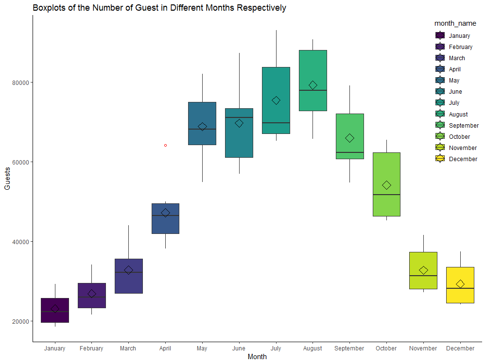
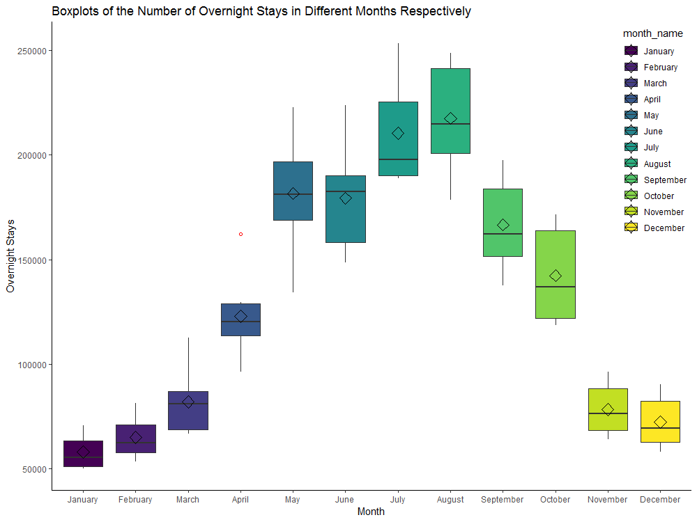
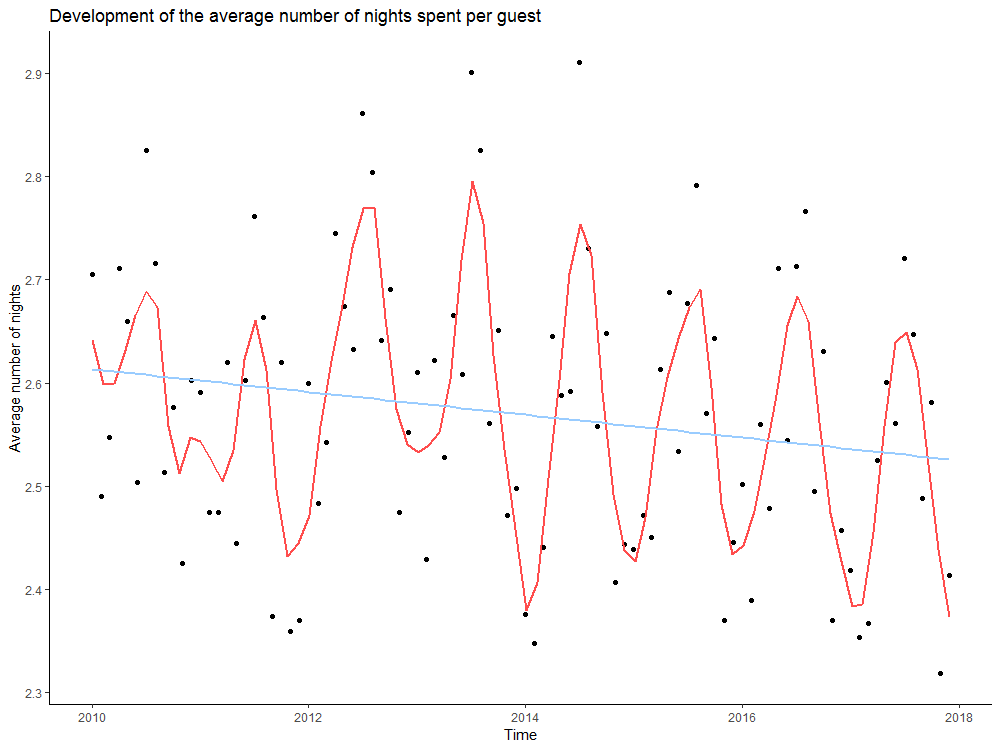
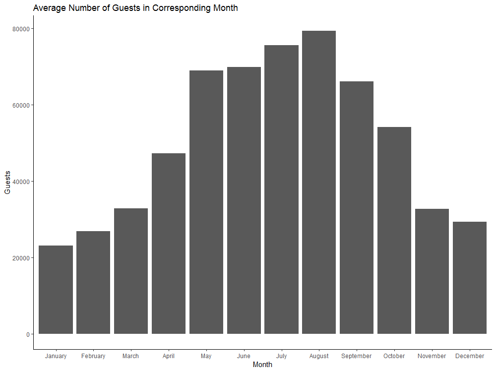
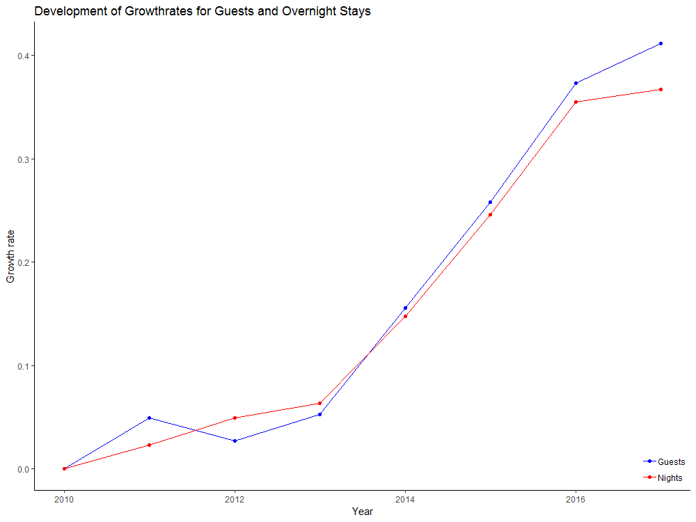
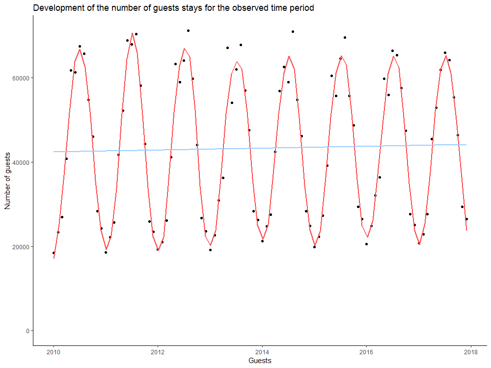

# SPL_WeatherTourism_03tourismAnalysis  

```
Name of Quantlet:  SPL_WeatherTourism_03tourismAnalysis

Published in:      'Statistical programming languages - Student Project on ''Impact of Meteorological Factors on Regional Tourism'' '

Description:       'Analysis and Transformation of the monthly observations of guests and nights, Creation of target variables for regression analysis, Visualization of Tourism Developments'

Keywords:          tourism analysis, transformation, visualization, indexing, relative deviations

Author:            Tim Peschenz

Submitted:         So, Mar 17 2019
```















## R Code
```R
# Name of Quantlet:  SPL_WeatherTourism_03tourismAnalysis
# Published in:      'Statistical programming languages - Student Project on ''Impact of Meteorological Factors on Regional Tourism'' '
# Description:       'Analysis and Transformation of the monthly observations of guests and nights, Creation of target variables for regression analysis, Visualization of Tourism Developments'
# Keywords:          tourism analysis, transformation, visualization, indexing, relative deviations
# Author:            Tim Peschenz
# Submitted:         So, Mar 17 2019


############################################################
## Analysis of Tourism
############################################################

### checking for outliers in guests and nights ###
ggplot(tourism, aes(y = guest_count, x = month_name, fill=month_name)) +
  geom_boxplot(outlier.colour = "red", outlier.shape = 1) + 
  stat_summary(fun.y=mean, geom="point", shape=5, size=4) +
  ggtitle("Boxplots of the Number of Guest in Different Months Respectively") +
  xlab("Month") + 
  ylab("Guests") +
  theme_bw() +
  theme(panel.border         = element_blank(), 
        panel.grid.major     = element_blank(),
        panel.grid.minor     = element_blank(), 
        axis.line            = element_line(colour = "black"),
        legend.justification = c(1,1), 
        legend.position      = c(1,1))

ggplot(tourism, aes(y = night_count, x = month_name, fill=month_name)) +
  geom_boxplot(outlier.colour = "red", outlier.shape = 1) + 
  stat_summary(fun.y=mean, geom="point", shape=5, size=4) +
  ggtitle("Boxplots of the Number of Overnight Stays in Different Months Respectively") +
  xlab("Month") + 
  ylab("Overnight Stays") +
  theme_bw() +
  theme(panel.border         = element_blank(), 
        panel.grid.major     = element_blank(),
        panel.grid.minor     = element_blank(), 
        axis.line            = element_line(colour = "black"),
        legend.justification = c(1,1), 
        legend.position      = c(1,1))

#It can be seen that there is one outlier in April, represented by the red circle in both, the number of
#guests and the number of nights.


### extracting the outlier in April ###
april      = subset(tourism, month_name == "April")
april_outl = which(april$guest_count > mean(april$guest_count) + 2*sd(april$guest_count))
april[april_outl, ]

#The outlier was in April 2017. Since the vales are not unrealistic, the data point was not changed.


### calculate correlations between number of guests and nights ###
cor(tourism$guest_count, tourism$night_count)

#There is a high correlation between the number of guests and nights. Therefore, the following
#visualizations are only made for the number of guests, since the graphs would look quite similar
#for the number of nights, just with up-scaled numbers.


### visualize distribution of guests counts ###
ggplot(tourism, aes(x = guest_count)) + 
  geom_histogram(aes(y=..density..), binwidth = 2500, colour="black", fill="white") +
  geom_density(alpha=.15, fill="#31B404") +
  ggtitle("Density Function and Histogramm of the Number of Guests Over the Observed Time Period") +
  xlab("Guests") + 
  ylab("Density Function and Histogramm") +
  theme_bw() +
  theme(panel.border     = element_blank(), 
        panel.grid.major = element_blank(),
        panel.grid.minor = element_blank(), 
        axis.line        = element_line(colour = "black"))

#There are two "peaks" in the number of guests. The first represents the no-season time and the second 
#one the tourism season period in the region.


### visualize development of guests ###
ggplot(data = tourism, aes(x = date_beg, y = guest_count)) + 
  geom_point() +
  stat_smooth(span=1/12, col = "#ff4d4d", se = FALSE) +
  geom_smooth(col = "#99ccff", method = "lm", se = FALSE) +
  ggtitle("Development of the Number of Guests") +
  xlab("Guests") + 
  ylab("Number of Guests") +
  expand_limits(y = 0) +
  theme_bw() +
  theme(panel.border        = element_blank(), 
        panel.grid.major     = element_blank(),
        panel.grid.minor     = element_blank(), 
        axis.line            = element_line(colour = "black"),
        legend.justification = c(1,0), 
        legend.position      = c(1,0))

#The seasonal developments are represented by the red line. We can see that there is a high seasonality
#between winter and summer. Also, there is an overall upward trend, represented by the blue line.


### adding average number of days per guest spent in region (overnight stays / guests) ###
tourism$avg_time = tourism$night_count/tourism$guest_count


### creating overall monthly averages and standard deviations for tourism data ###
tourism_tab = data.table(tourism)
monthly     = data.frame(tourism_tab[,list(mean_guest  = mean(guest_count),
                                           sd_guest    = sd(guest_count), 
                                           mean_nights = mean(night_count),
                                           sd_nights   = sd(night_count)),
                                      by = tourism$month_name])

colnames(monthly)[1] = "Month"

#Having now the month-wise means, it is possible to calculate the deviations of tourism flows for the 
#individual data points.


### comparing average guests per month to find out seasonal month ###
ggplot(data = monthly, aes(x = Month, y = mean_guest)) +
  geom_bar(stat="identity") +
  ggtitle("Average Number of Guests in Corresponding Month") +
  xlab("Month") + 
  ylab("Guests") +
  theme_bw() +
  theme(panel.border     = element_blank(), 
        panel.grid.major = element_blank(),
        panel.grid.minor = element_blank(), 
        axis.line        = element_line(colour = "black"))

#We can see a similar shape than in the boxplots beforehand. Again, the seasonal changes can be observed,
#with a clear focus in the spring and summer time and the beginning of autumn.


#define season month (guests > 50000)
season_month = monthly$Month[which(monthly$mean_guest > 50000)]

#adding binary variable that specifies whether a month is in the season or not
season_check = function(x, y){
  if(x %in% y){
    return ("Yes")
  }else{
    return("No")
  }
}

tourism$season = factor(sapply(as.list(tourism$month_name), season_check, season_month))

#According to the above definition, the tourism season in the region is from May until October.


#comparing numbers in season and no season
mean(tourism$guest_count[tourism$season == "Yes"])
mean(tourism$guest_count[tourism$season == "No"])

#The mean value of tourists per month is more than double in the seasonal month compared to the 
#non-season period.


### development of average number of nights per guest ###
ggplot(data = tourism, aes(x = date_beg, y = avg_time)) + 
  geom_point() +
  stat_smooth(span=1/12, col = "#ff4d4d", se = FALSE) +
  geom_smooth(col = "#99ccff", method = "lm", se = FALSE) +
  ggtitle("Development of the average number of nights spent per guest") +
  xlab("Time") + 
  ylab("Average number of nights") +
  theme_bw() +
  theme(panel.border     = element_blank(), 
        panel.grid.major = element_blank(),
        panel.grid.minor = element_blank(), 
        axis.line        = element_line(colour = "black"))

#For the average number of nights per guest, we can observe a much smaller seasonality than 
#for the absolute numbers of guests and nights. Also, there is a slight downward tendency, represented by 
#the blue line again. This means that the average duration of stay decreased during the observation period.


### calculate the absolute deviation of guests and overnight stays from monthly mean ###
tourism$abs_guest_deviation = 
  tourism$guest_count - c(replicate(8, month_means$mean_guest_count))
tourism$abs_night_deviation = 
  tourism$night_count - c(replicate(8, month_means$mean_night_count))

plot(tourism$abs_guest_deviation)

#We can observe a systematic upward trend of the deviations, which is caused by the overall growth in
#the number of guests and nights.


### calculate relative deviation in percent ###
tourism$rel_guest_deviation = tourism$abs_guest_deviation/tourism$guest_count
tourism$rel_night_deviation = tourism$abs_night_deviation/tourism$night_count

plot(tourism$rel_guest_deviation)

#We can observe the same systematic upward trend for the relative deviation with the same reasoning. 
#Therefore it is necessary to recalculate the number of guests and nights without the growth 
#developments to use them in the analysis.


### calculate annual growth of guests and nights compared to basis year = 2010 ###
obs             = data.frame("year" = format(tourism$date_beg, format = "%Y"))
obs$guest_count = tourism$guest_count
obs$night_count = tourism$night_count

years_index = obs %>%
  group_by(year) %>%
  summarize_all(sum)

years_index$guest_growth = (years_index$guest_count/years_index$guest_count[1])-1
years_index$night_growth = (years_index$night_count/years_index$night_count[1])-1

#plot growth rates compared to basis year
ggplot(years_index, aes(x = c(2010:2017))) + 
  geom_line(aes(y = guest_growth, color = "blue")) +
  geom_line(aes(y = night_growth, color = "red")) +
  ggtitle("Development of Growth-rates for Guests and Overnight Stays") +
  xlab("Year") + 
  ylab("Growth rate") +
  scale_colour_manual(labels = c("Guests", "Nights"), values = c("blue", "red")) +
  geom_point(aes(y = guest_growth, color = "blue")) +
  geom_point(aes(y = night_growth, color = "red")) +
  theme_bw() +
  theme(panel.border         = element_blank(), 
        panel.grid.major     = element_blank(),
        panel.grid.minor     = element_blank(), 
        axis.line            = element_line(colour = "black"),
        legend.justification = c(1,0), 
        legend.position      = c(1,0),
        legend.title         = element_blank())

#The growth development is quite strong. Between 2010 and 2017, there was an increase of 41,2% for guests
#and 36,7% for the number of nights per year.


### recalculate guests and nights "without" growth (in values of basis year 2010) ###
tourism$guest_basis = 0

j = 2010
for(i in c(1:8)){
  tourism[which(as.numeric(format(tourism$date_beg, format = "%Y")) == j), ]$guest_basis = 
    tourism$guest_count[which(as.numeric(format(tourism$date_beg, format = "%Y")) == j)]/
    (1+years_index$guest_growth[i])
  j = j + 1
}

#for nights
tourism$night_basis = 0

j = 2010
for(i in c(1:8)){
  tourism[which(as.numeric(format(tourism$date_beg, format = "%Y")) == j), ]$night_basis = 
    tourism$night_count[which(as.numeric(format(tourism$date_beg, format = "%Y")) == j)]/
    (1+years_index$night_growth[i])
  j = j + 1
}


### check adjusted development ###
ggplot(data = tourism, aes(x = date_beg, y = guest_basis)) + 
  geom_point() +
  stat_smooth(span=1/12, col = "#ff4d4d", se = FALSE) +
  geom_smooth(col = "#99ccff", method = "lm", se = FALSE) +
  ggtitle("Development of the number of guests stays for the observed time period") +
  xlab("Guests") + 
  ylab("Number of guests") +
  expand_limits(y = 0) +
  theme_bw() +
  theme(panel.border     = element_blank(), 
        panel.grid.major = element_blank(),
        panel.grid.minor = element_blank(), 
        axis.line        = element_line(colour = "black"))

#By using the indexed versions of the tourism measures, we can now see that there is no overall 
#upward trend anymore. Therefore, calculating the deviations from the indexed values no has no 
#systematic trend any more. The deviations can now be used for the analysis.


### calculate monthly means of newly generated indexed basis variables ###
basis             = data.frame("month" = rep(seq(1:12), 8))
basis$guest_basis = tourism$guest_basis
basis$night_basis = tourism$night_basis

basis     = data.table(basis)
mon_basis = data.frame(basis[,list(mean_guest_basis  = mean(guest_basis),
                                   sd_guest_basis    = sd(guest_basis), 
                                   mean_nights_basis = mean(night_basis),
                                   sd_nights_basis   = sd(night_basis)),
                             by=basis$month])


### calculate the deveation of guests and overnigth stays from monthly mean of the basis observations ###
tourism$abs_guest_dev_basis = tourism$guest_basis - c(replicate(8, mon_basis$mean_guest_basis))
tourism$abs_night_dev_basis = tourism$night_basis - c(replicate(8, mon_basis$mean_nights_basis))

#The indexed absolute deviation helps to decrease the impact of the seasonality on the analysis. But there are
#still differences between the numbers in season and non-season.

plot(tourism$abs_guest_dev_basis)

#Now there is no systematic trend in the data any more.


### find out relative deviation in percent from monthly mean of the basis observations ###
tourism$rel_guest_dev_basis = tourism$abs_guest_dev_basis/tourism$guest_basis
tourism$rel_night_dev_basis = tourism$abs_night_dev_basis/tourism$night_basis

#The indexed relative deviation now helps to create an equal basis for all deviations. The deviations are now 
#aligned with the tourism values of the respective months.

plot(tourism$rel_guest_dev_basis)

#The same is true for the relative deviations.


#delete not relevant columns from tourism data frame
tourism$abs_guest_deviation = NULL
tourism$abs_night_deviation = NULL
tourism$rel_guest_deviation = NULL
tourism$rel_night_deviation = NULL


